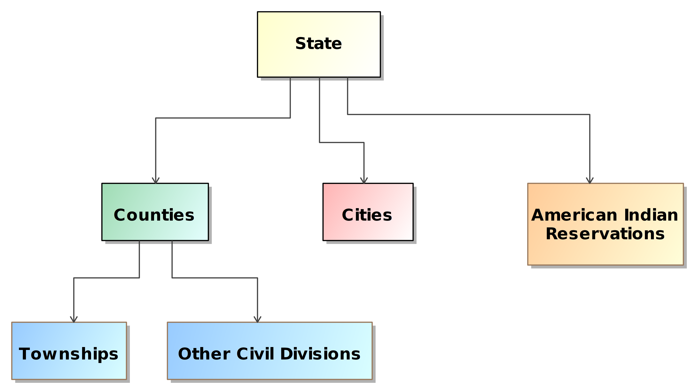
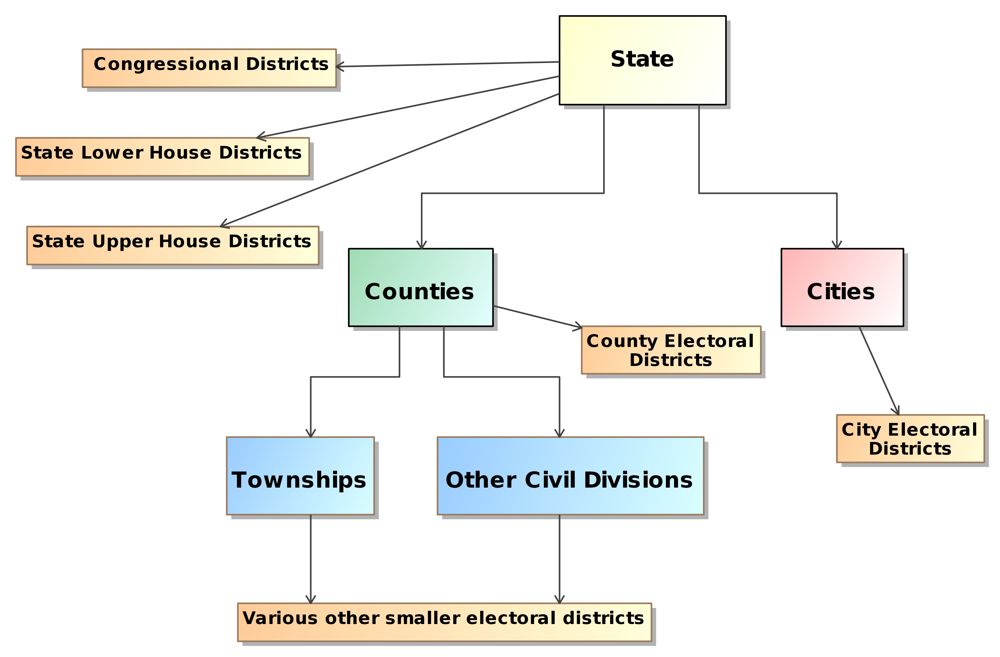
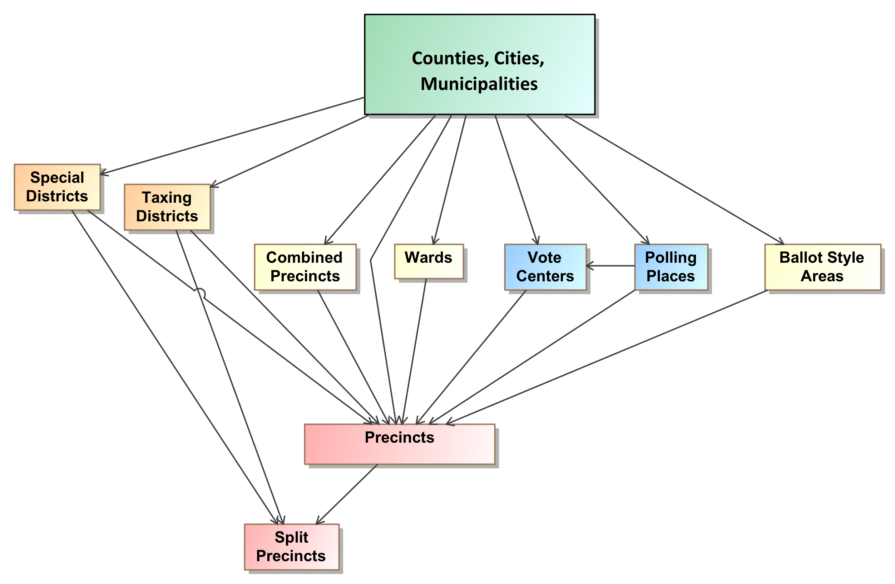
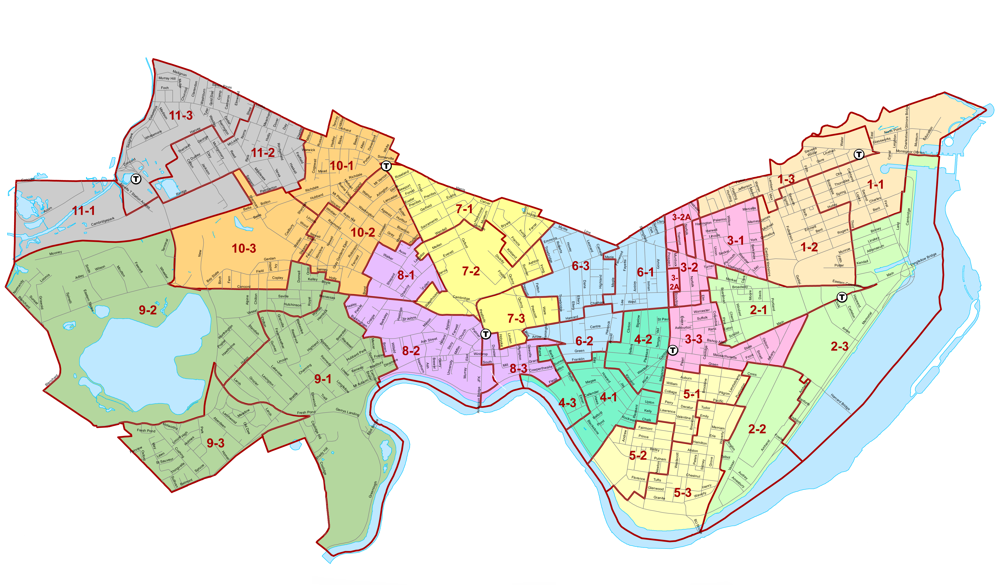
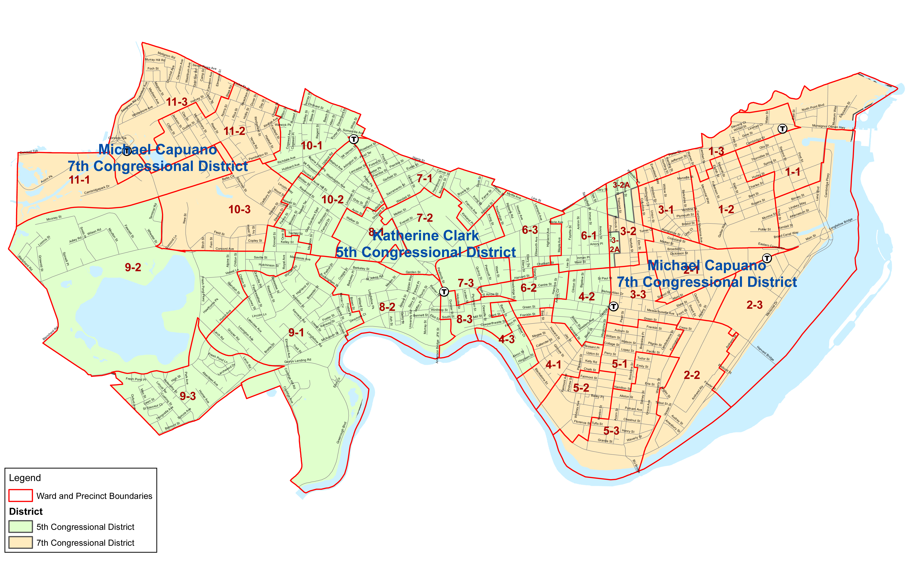
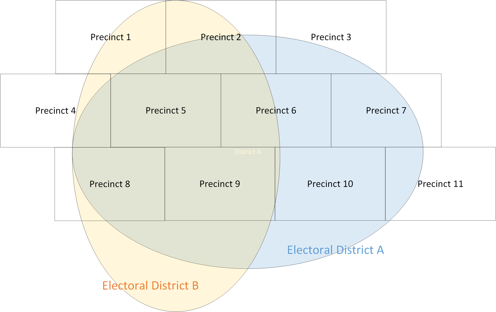
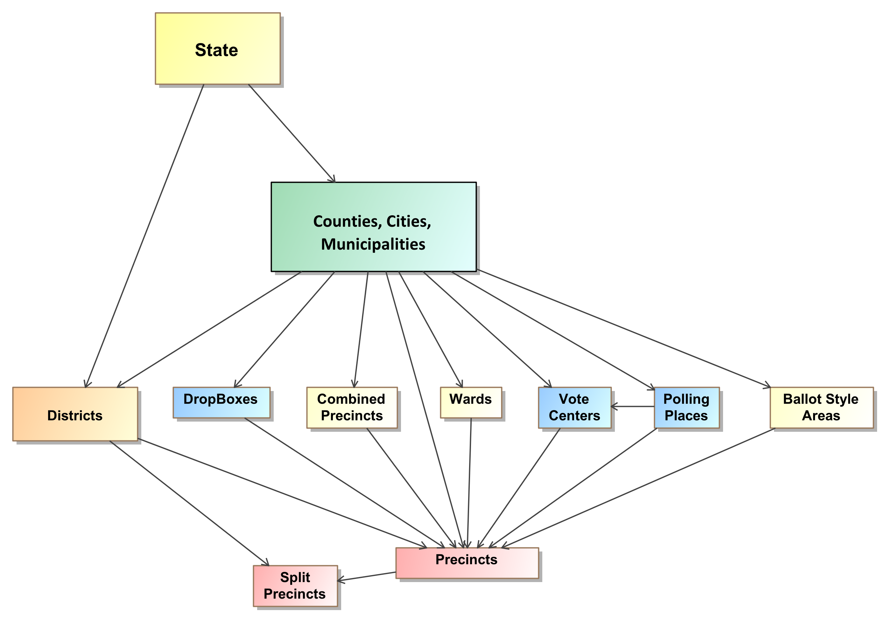
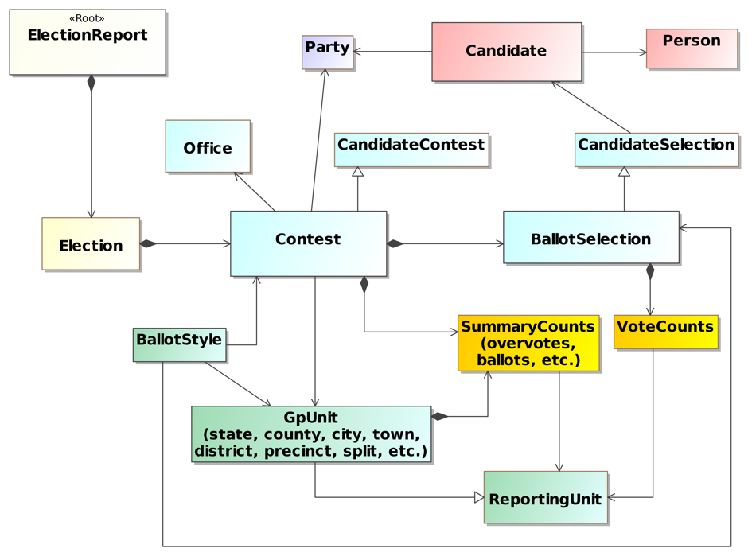
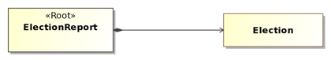

<title>NIST SP 1500-100 Election Results Reporting Common Data Format Specification Version 1.0</title>
# **NIST SP 1500-100 Election Results Reporting Common Data Format Specification Version 1.0**

### **February 2016**

*Note: This is a partial GitHub pages version of the NIST SP 1500-100 specification that is currently in process of being converted from the Word/PDF version. The specification in PDF is located at [https://github.com/usnistgov/ElectionResultsReporting](https://github.com/usnistgov/ElectionResultsReporting).*

**Kim Brace 
Sam Dana 
Herb Deutsch 
John Dziurlaj 
Ian Piper 
Don Rehill 
Richard Rivello 
John P. Wack 
Sarah Whitt**

 

This publication is available free of charge from: [http://dx.doi.org/10.6028/NIST.SP.1500-100](http://dx.doi.org/10.6028/NIST.SP.1500-100)

	NIST Special Publication series 1500 is intended to capture external perspectives related to NIST standards, measurement, and
	testing-related efforts. These external perspectives can come from industry, academia, government, and others. These reports are
	intended to document external perspectives and do not necessarily represent official NIST positions.

	Certain commercial entities, equipment, or materials may be identified in this document in order to describe an experimental
	procedure or concept adequately. Such identification is not intended to imply recommendation or endorsement by NIST, nor is it
	intended to imply that the entities, materials, or equipment are necessarily the best available for the purpose.

	There may be references in this publication to other publications currently under development by NIST in accordance with its
	assigned statutory responsibilities. The information in this publication, including concepts and methodologies, may be used by
	federal agencies even before the completion of such companion publications. Thus, until each publication is completed, current
	requirements, guidelines, and procedures, where they exist, remain operative. For planning and transition purposes, federal
	agencies may wish to closely follow the development of these new publications by NIST.

	Organizations are encouraged to review all draft publications during public comment periods and provide feedback to NIST.
	All NIST publications are available at http://www.nist.gov/publication-portal.cfm.

	National Institute of Standards and Technology
	Attn: Software and Systems Division, Information Technology Laboratory
	100 Bureau Drive (Mail Stop 8970) Gaithersburg, MD 20899-8930
	Email: voting@nist.gov

## Abstract
This publication describes an election results common data format specification for pre-election setup information and post-election results reporting.  It contains a UML model of the election data and an XML format derived from the UML model.  It also contains background information regarding how geopolitical geography is structured and used in the model and schema.  The XML format is comprehensive and at the same time very flexible, able to accommodate election scenarios used throughout the U.S. It is part of a series of planned common data format specifications for voting equipment.

## Keywords
Ballot; common data format; contest; district; election results; jurisdiction; overvote; political office; political party; precinct; referendum; undervote, voting.

## Table of Contents

<!-- TOC depthFrom:1 depthTo:6 withLinks:1 updateOnSave:0 orderedList:0 -->

- [Acknowledgements](#acknowledgements)
- [Executive Summary](#executive-summary)
- [1	Introduction](#1-introduction)
	- [1.1	Purpose](#11-purpose)
	- [1.2	Audience](#12-audience)
	- [1.3	Motivation and methodology](#13-motivation-and-methodology)
	- [1.4	Document Structure](#14-document-structure)
- [2 Background: Geopolitical Geography](#2-background-geopolitical-geography)
	- [2.1 The Primary Types of Geopolitical Geography](#21-the-primary-types-of-geopolitical-geography)
		- [2.1.1 Governmental-based Geography](#211-governmental-based-geography)
		- [2.1.2 Political-based Geography](#212-political-based-geography)
		- [2.1.3 Administrative-based Geography](#213-administrative-based-geography)
	- [2.2 Linking the Geopolitical Geographies Together](#22-linking-the-geopolitical-geographies-together)
	- [2.3 Geopolitical Geography in the UML Model and XML Schema](#23-geopolitical-geography-in-the-uml-model-and-xml-schema)
- [3 Use Cases and UML Model](#3-use-cases-and-uml-model)
	- [3.1	Use Cases](#31-use-cases)
		- [3.1.1	Pre-Election Use Case](#311-pre-election-use-case)
		- [3.1.2	Election Night Reporting Use Case](#312-election-night-reporting-use-case)
		- [3.1.3	Post-Election Reporting Use Case](#313-post-election-reporting-use-case)
	- [3.2	UML Model](#32-uml-model)
		- [3.2.1	Major Classes](#321-major-classes)
		- [3.2.2	Relationships between Classes](#322-relationships-between-classes)
- [XML Schema](#xml-schema)

<!-- /TOC -->

 

## Acknowledgements
The authors wish to thank their colleagues of the National Institute of Standards and Technology Interoperability Public Working Group, who
reviewed drafts of this document and contributed to its technical content.  The authors gratefully acknowledge and appreciate the following
contributors for their keen and insightful assistance with developing this specification:

* Kenneth Bennett, Office of Registrar-Recorder /County Clerk, Los Angeles
* Thomas Connolly, New York State Board of Elections
* Art Greisser, Prometheus Computing
* Chris Jerdonek, Elections Commission, City and County of San Francisco
* Arthur Keller, University of California
* Jared Marcotte, The Turnout
* Lauren Massa-Lochridge, Independent Researcher
* Neal McBurnett, ElectionAudits
* John McCarthy, Verified Voting
* Janet Modrow, Florida Division of Elections
* Justin Moore, Google
* Tammy Patrick, Bipartisan Policy Institute
* Benjamin Rice, Dominion Voting
* John Sebes, OSET Foundation
* Paul Stenbjorn, Election Information Services
* Beth Ann Surber, Office of the Secretary of State, West Virginia
* David Tarrent, Bureau of Elections, Michigan
* David Webber, Horizon Industries

In addition to the above acknowledgments, the authors also gratefully acknowledge and appreciate the National Institute of Standards and Technology's
Mary Brady, James Foti, and Joshua Franklin, for their exceptional contributions in helping to improve the content of the publication.  The authors also gratefully acknowledge and appreciate the significant contributions from individuals and organizations in the
public and private sectors, whose thoughtful and constructive comments improved the overall quality, thoroughness, and usefulness of this publication.

 

## Executive Summary
This publication is a specification for a common data format (CDF) for pre-election setup information and post-election results reporting.  The format, known as the Election Results Common Data Format Specification, is comprehensive and detailed in its coverage of election results-related data and at the same time very flexible, able to accommodate election scenarios used throughout the United States.  This publication contains a UML (Unified Modeling Language) model, a derived XML (eXtensible Markup Language) schema, usage information and guidance, and background information.

This specification provides a common data interchange format for election data used in voting systems across U.S. jurisdictions. Using this specification, pre-election and post-election data can be published in a common, well-understood format. The format accommodates highly detailed election results data and is sufficiently flexible to accommodate many different types of contests and political structures.

This specification provides manufacturers of election management systems (EMS) and managers of election jurisdictions with standard methods for importing and exporting election data, thereby increasing interoperability among election devices and reducing the need to create software to translate between proprietary formats.  Interoperable data will reduce costs to election jurisdictions by reducing the complexity in election management and offering jurisdictions more choice in election equipment.

This specification is geared towards the following audiences:

*	Election officials,
*	Voting equipment manufacturers,
*	Election-affiliated organizations, and
*	Election analysts and the general public.

The format accommodates three different election scenarios:

**Pre-election**.  The period prior to an election, for reporting pre-election data from a jurisdiction but not yet complete information about any election.

**Election**.  The period during which an election is being conducted and election results reports are produced.  The reports include aggregated results data or more detailed, precinct-level reporting, depending on the capabilities of the reporting jurisdiction.

**Post-election**.  The period after the close of polls when more detailed election results reports are produced with options for precinct reporting, type of ballot, and type of device.

The XML schema associated with this specification is derived from a UML model that defines the types, structure, and interrelationships of geopolitical geography across the U.S.  The model was designed to accommodate multiple types of contests and their many variations, and to provide the capability to report on these contests from higher aggregate levels down to very fine levels of detail, including:

* Reporting by precinct and splits of precincts;
*	Reporting by ballot type, e.g., absentee, election day; and
*	Reporting by device type and specific voting device.

The UML model can be re-used and modified to meet the needs of other planned common data format specifications for voting devices such as electronic pollbooks and ballot marking devices.

 

# 1	Introduction
This publication is a specification for an XML-based (eXtensible Markup Language) common data format (CDF) for exchanging pre-election and post-election data from voting systems used for managing elections and tabulating election results across states and territories of the United States.  The format serves as a basic export of election information from an election management system (EMS) and as a means for combining election data from different EMSs or transferring election data between EMSs.  It defines common exchange methods between distributed voting places and central offices as well as from election offices to news media and the general public. These common exchange methods promote interoperability and eliminate the need for proprietary formats.
This specification includes a data model in UML (Unified Modeling Language) that specifies and defines the data involved in pre-election setup and post-election results reporting.  The XML format is derived from the UML model.

The primary features of this specification are:

*	Major data elements and their attributes and associations are fully defined in a UML data model;
*	The data model can be used to generate data formats (e.g., XML, JSON (JavaScript Object Notation)) for today’s election systems as well as for future election systems;
*	Election data and results can be reported at flexible levels from highly aggregated to very detailed;
*	Detailed reporting includes by device type, by type of ballot, and by geopolitical geographies including precinct and split precinct;
*	Geopolitical units of geography can be specified in a flexible manner to mirror reporting structures used across states and counties and cities;
*	Major elements such as contests, geopolitical units, and parties include the capability to support multiple types of identifiers and cross-references; and
*	Detailed instructions for implementation and use of the XML schema are included.

 

## 1.1	Purpose
The purpose of this specification is to provide a comprehensive, flexible, and interoperable pre-election setup and post-election results reporting XML format for manufacturers to integrate into their voting equipment and for election offices, the media, and other groups to use in their own software.  The advantages of using this specification include:

*	Election results can be reported directly from election offices in this format regardless of voting system manufacturer, thus enabling interoperability;
*	The need for custom software and custom reporting formats is greatly reduced;
*	Jurisdictions that use multiple versions of EMSs and tabulators can more easily combine and transfer information between systems; and
*	Consistency in election results reports across different voting systems, jurisdictions, and states, will make reporting on election performance, e.g., for the EAC (Election Assistance Commission) election administration and voting survey (EAVS) and other election analyses, easier and more accurate.

 

## 1.2	Audience
The intended audience of this specification includes election officials, manufacturers and developers, as well as others in the election community including the general public.  Election results reporting is deceptively complex, thus some background in election administration or technology is useful in understanding the material in this specification.

 

## 1.3	Motivation and methodology
This specification was motivated primarily to reduce the inherent complexity for U.S. election officials in collecting and publishing election data, especially on election night when time frames are tight and there are more opportunities for error and a greater need for automation.  The process of reporting election results is a highly complicated activity that occurs over several different time frames and in multiple scenarios.  The equipment involved and data produced often do not interoperate, adding more complexity to the process.  Additionally, there are sometimes significant variations among different jurisdictions within a state as well among the states themselves in the way they perform election results reporting.

NIST and a community of U.S. election officials, analysts, and voting system manufacturers investigated reporting scenarios and their associated geopolitical geographies throughout the United States and in existing and emerging voting systems.  Further study included evaluation of other XML schemas associated with U.S. elections, including:

*	The State of Florida XML schema for election results reporting [4],
*	The Pew Voting Information Project XML schema version 3.0 [5],
*	The OASIS Election Markup Language (EML) XML schema version 7.0 [6], and
*	Schemas created by the Associated Press.

From this analysis, three use cases were developed for election results reporting:

1.	Pre-election – election data that is known ahead of the election; basically an export from an EMS of the contests, candidates, ballot initiatives, information about offices, and the geopolitical geographies associated with the reporting jurisdiction;

2.	Election night – reporting of election results either summarized by contest and jurisdiction or broken down by individual reporting units such as precincts, and associated formats, either as updates or corrections to previous reports or as internal intermediate reports within a state or county; and

3.	Post-election – updates and the final results compiled during the post-election canvass.

A UML data model was subsequently generated to define the data associated with the use cases and to show the relationship and organization of the data elements.  Finally, an XML schema was generated from the UML data model.  The XML schema defines the rules of the XML format.

The advantages of using a UML data model as an intermediate step to generating an XML schema include (1) that the model is independent of the concrete XML format or other potential formats that could be derived and (2) relationships between data elements are easier to correctly define and visualize when they are independent of any specific data format.  If changes are needed to the XML format, one can make changes to the UML model and generate a new version of the format.
Note that this specification addresses U.S. governmental elections and is not intended for use “as is” in other types of elections or in other countries.  However, the specification was written with the intention that it be adaptable to other election environments.

 

## 1.4	Document Structure
Section 2 starts with an overview of geopolitical geographies such as counties, districts, and precincts, describing how they are categorized, how they interrelate, and how election results are tied to them.  Section 3 contains an overview of the three use cases for election results reporting and the UML data model that implements the use cases.  Section 4 contains documentation for the XML schema that is derived from the UML model.  Section 5 describes how to use the major features of the schema.  

The appendices include references, definitions, acronyms, and instructions for downloading the files associated with this specification.

 

# 2 Background: Geopolitical Geography
This section provides an overview of the geopolitical geography in the United States as it relates to elections and election results reporting, and serves to provide background for how geopolitical geography is implemented in the UML model and XML schema that are described in sections 3 through 5.  Knowledge of what constitutes geopolitical geography and how it is interrelated and used in elections provides the underpinning for understanding the complexities of election results reporting.  

 

## 2.1 The Primary Types of Geopolitical Geography
The primary types of geopolitical geography include those geographies that run elections such as states, counties, and cities, as well as the many types of electoral districts that are tied to contests, precincts, and various other geographical units associated with political boundaries.  Generally, the media and election analysts wish to obtain voting results broken out by these units, thus the process of running an election includes associating contests and vote counts with these units so that they can be ultimately reported.

Ballot counts and vote counts for contests can be associated with a variety of different types of geopolitical geography, ranging from aggregated counts associated with a county or state down to more detailed counts associated with a precinct and breakdowns of a precinct.  Precincts are generally the smallest unit of geopolitical geography, and in many states, there is generally one polling place per precinct.  Precincts can be thought of as the bricks or building blocks that compose all other geopolitical geography.

Geopolitical geography can often be quite complex in that some are hierarchical, others overlap, and still others change their boundaries regularly, sometimes several times within a year.  Changes to city and district boundaries affect precinct boundaries, splitting them into multiple parts (called split precincts), with each part requiring distinct ballot styles.  

The following sections break down geopolitical geography into three primary types and show how the geographies interrelate.  These three types are:

1. Governmental-based geography,
2. Political-based geography, and
3. Administrative-based geography.

 

### 2.1.1 Governmental-based Geography
Governmental-based geography refers to entities that (1) run elections and (2) are well-established and do not change over time, with the exception of some cities.   For many states, the governmental-based geography is hierarchical, as shown in Figure 1.  This can be categorized as follows:

- States,
- Counties,
- Cities,
- American Indian Reservations,
- Towns and Townships, and
- Other Civil Divisions.

Nearly all states have counties, although some use different words to describe them, e.g., parishes for Louisiana and boroughs for Alaska.   Townships occur in 20 states and adhere to county boundaries.   In the six New England states, townships run the election process and there is no county government, thus election results are reported directly to the state. Municipalities (cities, towns, or villages) in Michigan, Minnesota, and Wisconsin also run their elections, but report their information to the county, which then reports to the state.  Other civil divisions include boroughs as used in Connecticut, New Jersey, Pennsylvania, and other states; New York City's boroughs are treated as counties.

**Figure 1 - Governmental-based Geographies**

Governmental-based geographies are associated with offices that are elected jurisdiction-wide (such as for Governor, County Clerk, Supervisor, Treasurer, Assessor, Highway Commissioner, etc.) and thus do not require different ballot style areas within the geography for those offices, i.e., all voters in the jurisdiction vote for the office.  
Governmental-based geographies do not cross the lines of the precincts that compose them; however cities can change their boundaries through annexations and, in some states, city boundaries can also cross county boundaries. Thus, changes to city boundaries may result in crossing the boundaries of one or more precincts, creating split precincts and requiring a distinct ballot style per split precinct.   

 

### 2.1.2 Political-based Geography
Political-based geographies are those that tend to be population-based and therefore may change with each U.S. Census every 10 years in a process known as re-districting.  Political-based geographies are generally known as electoral districts, where people are elected to an office that has jurisdiction within a specific geography, e.g., a U.S. Congressional district.

**Figure 2 - Political-based Geographies**

Figure 2 shows the most common political-based geographies as they interrelate with the governmental-based geographies.  Political-based geographies can be categorized as follows:

- U.S. Congressional districts;
- State senate or upper-house districts;
- State house or lower-house districts (in some states, several state house districts combine to form a state senate district);
- County electoral districts;
- City electoral districts (sometimes called Wards); and
- Numerous other forms of electoral districts.

Because electoral districts can change as they are re-drawn, political-based geographies will often divide precincts, creating split precincts and requiring a distinct ballot style per split precinct.   

 

### 2.1.3 Administrative-based Geography
Administrative-based geographies are called thus because their boundaries are determined via election or civil administration.  Administrative-based geographies include precincts and their various types such as wards, combined precincts, and split precincts.  They can be very small, sometimes only applying to several streets or houses or even only a single house along a street. They can involve territory that is non-contiguous in itself, e.g., for some of the taxing and special districts.  They can change a number of times throughout a given year, even daily in some cases.  Figure 3 shows the basic administrative-based geographies, which can be categorized as follows:

1. Election administrative areas;
	- Precincts, split precincts, combined precincts, wards;
	- Polling places, vote centers;
	- Various other ballot style areas;
2. Taxing districts, e.g., fire, water, sewer, transit, school, police, hospital, utilities; and
3. Special districts, i.e., unique areas brought together for a referendum.

**Figure 3 - Administrative-based Geographies**

 

## 2.2 Linking the Geopolitical Geographies Together
As an example of administrative-based geographies and their relationship to political-based and governmental-based geographies, Figure 4 shows the wards and precincts that make up the city of Cambridge, MA, and Figure 5 shows how the wards and precincts in the city compose the U.S. Congressional electoral districts [7].  The wards are implemented as collections of precincts.  In general, it is preferred that electoral districts are composed of whole precincts.

**Figure 4 - Ward and Precincts in Cambridge, MA.**

**Figure 5 - Districts Overlaying Wards and Precincts in Cambridge, MA.**

In many states, the boundaries of electoral districts may crisscross the precinct boundaries, creating one or more split precincts, with a distinct ballot style per split precinct.  Depending on the number of districts and how often they cross the precinct boundaries, the resultant number of ballot styles created may grow substantially beyond the number of whole precincts.  It is possible sometimes that, despite best efforts, very low numbers of voters or even just one voter will require a district ballot style.

**Figure 6 - Overlapping Non-hierarchical Electoral Districts**

As an example, Figure 6 shows two electoral districts that overlay a series of precincts.  Every time a precinct is not wholly contained within either of the districts, the precinct is split into however many pieces are necessary.  Figure 6 shows that a number of the precincts are split in different ways, e.g., Precinct 6 is split into two pieces.

Precinct 6 will thus require two distinct ballot styles, one for each of the splits.  To correctly tabulate the votes in the different electoral districts, it will be necessary to know which split of Precinct 6 is contained within each of the two electoral districts.

Precincts can be split as well by changes to the other administrative-based geographies. Adding to the complexity, a number of states now use combined precincts and vote centers on election night, which associate multiple precincts with one polling place.  This means that for a vote center handling multiple precincts that themselves may be split, there can be potentially many different ballot styles in use at the vote center, with each voting device needing to display any one of the ballots.  This adds further complexity and places additional demands on election jurisdictions on their ability to manage and report details of votes on election night and post-election [8].

To make this situation more manageable, some states/counties prefer over time to heal split precincts by combining them with other precincts or generally redrawing the precinct boundaries so that the number of ballot styles is reduced and election management and reporting is less complicated.

 

## 2.3 Geopolitical Geography in the UML Model and XML Schema
The previous discussion served to show that there are different types of geopolitical geography that overlap each other or behave hierarchically, resulting sometimes in very complex maps and many small geopolitical units that require distinct, different ballot styles.  Election officials may spend considerable time in managing this complexity.

Furthermore, each state and sometimes county or city will manage elections differently, using combinations of units such as combined precincts or wards, with specific rules about how the associated contests operate.  When one combines (a) the complexities of geopolitical geography with (b) the different election rules employed in the U.S. states and territories, one sees that running an election can be an extremely complicated endeavor.  Election results reporting mirrors this complexity.

It is important to note that the different geographies form relationships much like a lattice, in which objects can be related in non-hierarchical ways.  The UML model and XML schema implement geopolitical geography in this way using an object that can be linked with other objects depending on the type of geopolitical geography.  In the UML model, this object is referred to as the GpUnit (short for Geopolitical Unit) class, and in the XML schema it is called the `<GpUnit>` element.  GpUnits can model a district, or county, or precinct, etc., and can be linked to each other to mirror the real-world geopolitical geography of the reporting jurisdiction.

GpUnits can be linked hierarchically when modeling jurisdictional geographies.  To model a jurisdiction that runs/reports on elections, the lowest-level GpUnits, i.e., precincts, will be children of the election-running GpUnit, say a city or county or state.  

District GpUnits need to be linked to the precinct and/or split precinct GpUnits that compose them. The precincts and split precincts thus link the jurisdictional and district GpUnits together, as shown below in Figure 7 (and described in greater detail in section 5.2).  The wards are the children of the combined precincts, and so forth on up to the state.  The precincts and split precincts are also the children of the districts that they compose.  

**Figure 7 - GpUnit Structural Hierarchies**

 

# 3 Use Cases and UML Model
This section describes the three use cases for pre-election setup and post-election results reporting included in this specification, and then describes the UML model that implements the use cases and was used to generate the XML schema.  This section is provided for background and to assist in understanding how the model and schema are structured and used.

 

## 3.1	Use Cases
This section describes the three use cases for the following phases of pre-election setup and post-election results reporting:

1. **Pre-election** – for reporting of election data about offices, political parties, and the geopolitical geographies associated with the reporting jurisdiction, as well as any election-specific information such as the contests, candidates, or ballot measures;
2. **Election night** – for reporting of election results to the public during the election or on election night and for internal state rolls-ups of election results between and among election management systems; and
3. **Post-election** – for reporting the final results compiled during the post-election canvass, that is, when all results are re-examined and re-tabulated to ensure correctness.

 

### 3.1.1	Pre-Election Use Case
The pre-election use case enables election officials to report on a variety of election-related data; the data could include information about a specific upcoming election or it could provide more general information about the reporting jurisdiction so as to determine whether the election data is accurate and organized correctly or to convey information to the general public about contests and ballot information in an upcoming election.  Pre-election information may come from any of the databases or devices that an election jurisdiction uses to manage elections, including voter registration databases, ballot programming systems, candidate filing systems, EMSs, campaign finance systems, etc.  

The data for the pre-election use case includes the following:

1. Pre-election reports in a variety of formats, including:
  * As one complete file or a sequence of files;
  * As additions to previous reports; and
  * As corrections to previous reports;
2. Jurisdictions, districts, offices, precincts and voting locations within the scope of the reporting jurisdiction and how they are organized;
3. Political party information;
4. Offices associated with contests and districts;
5. Information about persons relevant to the jurisdiction such as authorities, candidates, office holders, etc.;
6. Election type, date, place, jurisdiction, authority information, registered voters. The type of election could include:
  - Open and closed partisan primaries;
  - Runoffs;
  - Special elections; and
  - General elections;
7. Ballot measures and contests, including retention contests;
8. Candidates on the ballot and their associated party affiliations and contact information;
9. Offices associated with the contests and electoral districts;
10. Vote-capture device types or the specific devices associated with polling places; and
11. Ballot styles containing contest and candidate information in the order as they appear on the ballot at specific precincts or split precincts.

 

### 3.1.2	Election Night Reporting Use Case
The election night reporting use case addresses aggregated, contest-level reporting of election results.  Depending on a jurisdiction’s capabilities, it could include further details such as precinct-level vote and ballot counts and breakdowns of counts by device type and ballot type.

The election night reporting use case involves election reporting managed in two primary ways:

1. By the counties (or cities, etc.) reporting directly to the public/media and, possibly, also reporting upward to the state, or
2. By the counties reporting upward to the state and the state reporting directly to the public/media.

When reporting upward to the state, election results are reported from local jurisdictions to the city or county or state level, where the results continue to be aggregated in a process referred to as rolling up the votes and creating state or county roll-ups.  As part of this process, internal, intermediate reports from different EMSs or databases need to be combined.  The roll-ups are then formatted and released to the media and public during election night until all results from the local jurisdictions are accounted for.  The results are, at this stage, considered as unofficial.

The data for election night reporting includes the following:

1.	Any information from the pre-election use case;
2.	Aggregated contest results for offices and ballot measures, including:
   * Votes reported in the contest;
   * Votes reported for each candidate(s) or selection(s) in the contest;
   * Overvotes reported for the contest; and
   * Undervotes reported for the contest;
3.	Further vote details as possible to report, including:
   * Breakdowns of votes by various reporting units such as precinct or split precinct;
   * Vote counts and ballot counts broken down by ballot type (absentee, early, etc.) and type of device (electronic, optical scan, etc.); and
   * Additional counts as available, e.g., the number of votes cast by party or the number of straight party selections.

 

### 3.1.3	Post-Election Reporting Use Case
The post-election reporting use case addresses the updates to the election night unofficial results. Post-election results contain greater detail than election night results, including results by reporting unit, by counts of different types of ballots (early, absentee, provisional, etc.), and by the type of vote-capture device used by voters to cast their ballots. They may also include results that were not available for election night reporting, such as absentee ballots received too close to the election day, or provisional ballots. This use case is of interest especially by analysts and media performing detailed analysis of election results and other items of interest such as the methods people are choosing to vote (e.g., favoring absentee over in-person) or provisional voting rejection rates.

The data for post-election night reporting includes:

1.	Any information from the pre-election and election night reporting use cases;
2.	Ballot measure and contest vote counts, including:
   *	By geopolitical units of geography (e.g., county, township, city, precinct, etc.);
   *	By type of ballot/voting (e.g., absentee, early, in-person, provisional);
   *	By type of voting equipment used (e.g., electronic, optical scan, etc.); and
   *	By overvotes and undervotes for each contest;
3.	Ballot measure and contest summaries broken down as per the vote counts, but also including the number of ballots on which the ballot measure or contest appeared; and
*	Precinct summaries broken down as per the vote counts.

 

## 3.2	UML Model
This section presents the UML model that was structured to implement the use cases.  It includes a class diagram that shows a picture of the model and an overview of how to read the relationships between the classes so as to understand how the model and XML schema are structured.

The UML model represents a format-independent description of the data required by the three use cases of the specification.  Its primary benefit is that it unambiguously defines and describes the data elements and how they are related without requiring readers to know the technical details of any particular data format implementation such as XML.  By using a model-based approach, the resultant data format is more likely to be well-structured and more tolerant to modifications.  The data format can be generated from the model using commercial tools, thus if changes need to be made to a format, the model can be changed and the format can be re-generated.  

Figure 8 shows a high-level view of the class diagram, minus its attributes and certain ancillary classes (the complete diagram is available for download, see Appendix C—References).

**Figure 8: Simplified UML Class Diagram**

 

### 3.2.1	Major Classes
Each class represents a major data element, e.g., Contest, Candidate, or Party, and classes that are highly related to each other are shown in the same color.  When XML is generated from the UML model, the classes in the model get generated as major XML elements, e.g., the UML Candidate class results in the XML `<Candidate>` element.  The major classes shown in Figure 8 are:

* **ElectionReport** – the root class, includes attributes describing the type of report, when generated, etc.;
* **Election** – for a specific election, includes attributes describing the type of election, date, etc.;
* **GpUnit** – short for “Geopolitical Unit,” for describing units of geopolitical geography so that they can be associated with contests, offices, ballot styles, and election results.  There are two major types of GpUnits:
  1.	ReportingUnit – for jurisdictions, districts, precincts, and other units for which election results can be associated; and
  2.	ReportingDevice – for types of voting devices or specific voting devices for which election results can be associated (not shown in Figure 8);
* **Office** – for political offices that are associated with contests and electoral districts and current office holders;
* **Party** – for political parties associated with the reporting jurisdiction and for associating the parties with candidates and contests;
* **Person** – for address and contact information for persons associated with the reporting jurisdiction, including boards of authorities, candidates, current office holders, or other election-related officials;
* **Contest** – for contests and for linking together the major elements needed for contests such as candidates and ballot selections and election results. There are four types of Contests:
  1.	CandidateContest – for contests involving candidates;
  2.	BallotMeasureContest – for contests involving ballot measures (not shown in Figure 8);
  3.	PartyContest – for straight-party selection (not shown in Figure 8); and
  4.	RetentionContest – for judicial or other types of retention contests (not shown in Figure 8);
* **Candidate** – for describing candidates so that they can be associated with contests;
* **BallotSelection** – for describing the types of ballot selections in a contest and associating them with election results:
  1.	BallotMeasureSelection – used if the ballot selection is for a ballot measure (not shown in Figure 8);
  2.	CandidateSelection – used if the ballot selection is for a candidate; and
  3.	PartySelection – used if the ballot selection is for a party as in straight party selections (not shown in Figure 8);
* **VoteCounts** – used for the vote counts associated with a ballot selection;
* **SummaryCounts** – for describing summary counts of overvotes and undervotes, write-ins, and ballot counts associated with (a) a contest or (b) geopolitical units such as precincts; and
* **BallotStyle** – for describing the contests and ballot selections on a ballot and linking them to geopolitical units such as precincts.

The attributes associated with the UML classes correspond closely to the XML schema’s attributes and sub-elements associated with the major elements, described in Section 4.

 

### 3.2.2	Relationships between Classes

The major classes in the UML model result in major elements in the XML schema, and the different types of relationships between the UML classes determine how the XML elements are structured (linked) in the schema.  There are three types of relationships between the classes:

**Directed Composition**: see Figure 9, ElectionReport and Election, read as, “An election report is composed of elections.”  In the XML schema, the `<Election>` element will be generated as a sub-element of the `<ElectionReport>` element. A directed composition relationship has a closed diamond at one end and an arrow pointing to the composing class:

**Figure 9 – Directed Composition Example**

**Is a Type of or Instance of**: see Figure 10, Contest and CandidateContest, read as, “A candidate contest is a type of contest.”  Contest is an abstract class; it is “implemented” by its concrete classes such as CandidateContest.  In the XML schema, Contest will be generated as an abstract XML element and serve as an extension base to the `<CandidateContest>` element. An instance relationship has an open triangle at one end, pointing from the concrete class to the abstract class:

**Figure 10 – “Is a Type of” Example**

**Directed Association**: see Figure 11, Candidate and Party, read as, “A candidate is associated with or linked to a party.”  In the XML schema, the `<Candidate>` element will include a `<PartyId>` element, which will contain an identifier associated with a `<Party>` element.  A directed association has an arrow at one end, goes in one direction, and serves to link the class to another associated class, e.g., the party linked to the candidate:

**Figure 11 – Directed Association Example**

The generation of XML elements from the UML model is discussed more specifically in section 5.1.2.
For the directed composition associations in Figure 8, one can see that ElectionReport is composed of Election, GpUnit, Office, Party, and Person.  Election is composed of BallotStyle, Candidate, and Contest.  Contest is composed of BallotSelection and SummaryCounts. BallotSelection is composed of VoteCounts.  GpUnit is also composed of SummaryCounts.

For the “is a type of” relationships in Figure 8, one can see that CandidateContest is a type of Contest.  ReportingUnit is a type of GpUnit.  CandidateSelection is a type of BallotSelection.

Lastly, for the directed associations in Figure 8, one can see that many of the classes are associated with each other, as one would expect.  For example, Party is associated with (or linked to) Candidate just as a political party would be associated with or linked to a candidate.  Candidate is associated or linked to CandidateSelection, just as a selection on the ballot in a candidate contest would be for a specific candidate.  The XML generation is more complicated for directed associations and is discussed in greater detail in section 5.1.3.

 

# XML Schema

    <?xml version="1.0" encoding="UTF-8"?>
    <!-- Version 1.0-50, January 11, 2016, NIST Election Results CDF Specification -->
    <xsd:schema xmlns="NIST_V1_election_results_cdf.xsd" xmlns:ds="http://www.w3.org/2000/09/xmldsig#" xmlns:xsd="http://www.w3.org/2001/XMLSchema" targetNamespace="NIST_V1_election_results_cdf.xsd" elementFormDefault="qualified" version="1.0">
    <!-- ========== Imports ========== -->
    <xsd:import namespace="http://www.w3.org/2000/09/xmldsig#" schemaLocation="http://www.w3.org/2000/09/xmldsig#"/>
    <!-- ========== Roots ========== -->
    <xsd:element name="ElectionReport" type="ElectionReport"/>
    <!-- ========== Primitives ========== -->
    <xsd:simpleType name="HtmlColorString">
       <xsd:restriction base="xsd:string">
          <xsd:pattern value="[0-9a-f]{6}"/>
       </xsd:restriction>
    </xsd:simpleType>
    <xsd:simpleType name="ShortString">
       <xsd:restriction base="xsd:string">
          <xsd:maxLength value="16"/>
       </xsd:restriction>
    </xsd:simpleType>
    <xsd:simpleType name="TimeWithZone">
       <xsd:restriction base="xsd:time">
          <xsd:pattern value="(([01][0-9]|2[0-3]):[0-5][0-9]:[0-5][0-9]|(24:00:00))(Z|[+-]((0[0-9]|1[0-3]):[0-5][0-9]|14:00))"/>
       </xsd:restriction>
    </xsd:simpleType>
    <!-- ========== Enumerations ========== -->
    <xsd:simpleType name="BallotMeasureType">
       <xsd:restriction base="xsd:string">
          <xsd:enumeration value="ballot-measure"/>
          <xsd:enumeration value="initiative"/>
          <xsd:enumeration value="referendum"/>
          <xsd:enumeration value="other"/>
       </xsd:restriction>
    </xsd:simpleType>
    <xsd:simpleType name="CandidatePostElectionStatus">
       <xsd:restriction base="xsd:string">
          <xsd:enumeration value="advanced-to-runoff"/>
          <xsd:enumeration value="projected-winner"/>
          <xsd:enumeration value="winner"/>
          <xsd:enumeration value="withdrawn"/>
       </xsd:restriction>
    </xsd:simpleType>
    <xsd:simpleType name="CandidatePreElectionStatus">
       <xsd:restriction base="xsd:string">
          <xsd:enumeration value="filed"/>
          <xsd:enumeration value="qualified"/>
          <xsd:enumeration value="withdrawn"/>
          <xsd:enumeration value="write-in"/>
       </xsd:restriction>
    </xsd:simpleType>
    <xsd:simpleType name="CountItemStatus">
       <xsd:restriction base="xsd:string">
          <xsd:enumeration value="completed"/>
          <xsd:enumeration value="in-process"/>
          <xsd:enumeration value="not-processed"/>
          <xsd:enumeration value="unknown"/>
       </xsd:restriction>
    </xsd:simpleType>
    <xsd:simpleType name="CountItemType">
       <xsd:restriction base="xsd:string">
          <xsd:enumeration value="absentee"/>
          <xsd:enumeration value="absentee-fwab"/>
          <xsd:enumeration value="absentee-in-person"/>
          <xsd:enumeration value="absentee-mail"/>
          <xsd:enumeration value="early"/>
          <xsd:enumeration value="election-day"/>
          <xsd:enumeration value="provisional"/>
          <xsd:enumeration value="total"/>
          <xsd:enumeration value="uocava"/>
          <xsd:enumeration value="write-in"/>
          <xsd:enumeration value="other"/>
       </xsd:restriction>
    </xsd:simpleType>
    <xsd:simpleType name="DayType">
       <xsd:restriction base="xsd:string">
          <xsd:enumeration value="all"/>
          <xsd:enumeration value="sunday"/>
          <xsd:enumeration value="monday"/>
          <xsd:enumeration value="tuesday"/>
          <xsd:enumeration value="wednesday"/>
          <xsd:enumeration value="thursday"/>
          <xsd:enumeration value="friday"/>
          <xsd:enumeration value="saturday"/>
          <xsd:enumeration value="weekday"/>
          <xsd:enumeration value="weekend"/>
       </xsd:restriction>
    </xsd:simpleType>
    <xsd:simpleType name="DeviceType">
       <xsd:restriction base="xsd:string">
          <xsd:enumeration value="electronic"/>
          <xsd:enumeration value="lever"/>
          <xsd:enumeration value="manual-count"/>
          <xsd:enumeration value="mixed-systems"/>
          <xsd:enumeration value="opscan-central"/>
          <xsd:enumeration value="opscan-precinct"/>
          <xsd:enumeration value="punch-card"/>
          <xsd:enumeration value="unknown"/>
          <xsd:enumeration value="other"/>
       </xsd:restriction>
    </xsd:simpleType>
    <xsd:simpleType name="ElectionType">
       <xsd:restriction base="xsd:string">
          <xsd:enumeration value="general"/>
          <xsd:enumeration value="partisan-primary-closed"/>
          <xsd:enumeration value="partisan-primary-open"/>
          <xsd:enumeration value="primary"/>
          <xsd:enumeration value="runoff"/>
          <xsd:enumeration value="special"/>
          <xsd:enumeration value="other"/>
       </xsd:restriction>
    </xsd:simpleType>
    <xsd:simpleType name="GeoSpatialFormat">
       <xsd:restriction base="xsd:string">
          <xsd:enumeration value="geo-json"/>
          <xsd:enumeration value="gml"/>
          <xsd:enumeration value="kml"/>
          <xsd:enumeration value="shp"/>
          <xsd:enumeration value="wkt"/>
       </xsd:restriction>
    </xsd:simpleType>
    <xsd:simpleType name="IdentifierType">
       <xsd:restriction base="xsd:string">
          <xsd:enumeration value="fips"/>
          <xsd:enumeration value="local-level"/>
          <xsd:enumeration value="national-level"/>
          <xsd:enumeration value="ocd-id"/>
          <xsd:enumeration value="state-level"/>
          <xsd:enumeration value="other"/>
       </xsd:restriction>
    </xsd:simpleType>
    <xsd:simpleType name="OfficeTermType">
       <xsd:restriction base="xsd:string">
          <xsd:enumeration value="full-term"/>
          <xsd:enumeration value="unexpired-term"/>
       </xsd:restriction>
    </xsd:simpleType>
    <xsd:simpleType name="ReportDetailLevel">
       <xsd:restriction base="xsd:string">
          <xsd:enumeration value="precinct-level"/>
          <xsd:enumeration value="summary-contest"/>
       </xsd:restriction>
    </xsd:simpleType>
    <xsd:simpleType name="ReportingUnitType">
       <xsd:restriction base="xsd:string">
          <xsd:enumeration value="ballot-batch"/>
          <xsd:enumeration value="ballot-style-area"/>
          <xsd:enumeration value="borough"/>
          <xsd:enumeration value="city"/>
          <xsd:enumeration value="city-council"/>
          <xsd:enumeration value="combined-precinct"/>
          <xsd:enumeration value="congressional"/>
          <xsd:enumeration value="county"/>
          <xsd:enumeration value="county-council"/>
          <xsd:enumeration value="drop-box"/>
          <xsd:enumeration value="judicial"/>
          <xsd:enumeration value="municipality"/>
          <xsd:enumeration value="polling-place"/>
          <xsd:enumeration value="precinct"/>
          <xsd:enumeration value="school"/>
          <xsd:enumeration value="special"/>
          <xsd:enumeration value="split-precinct"/>
          <xsd:enumeration value="state"/>
          <xsd:enumeration value="state-house"/>
          <xsd:enumeration value="state-senate"/>
          <xsd:enumeration value="town"/>
          <xsd:enumeration value="township"/>
          <xsd:enumeration value="utility"/>
          <xsd:enumeration value="village"/>
          <xsd:enumeration value="vote-center"/>
          <xsd:enumeration value="ward"/>
          <xsd:enumeration value="water"/>
          <xsd:enumeration value="other"/>
       </xsd:restriction>
    </xsd:simpleType>
    <xsd:simpleType name="ResultsStatus">
       <xsd:restriction base="xsd:string">
          <xsd:enumeration value="certified"/>
          <xsd:enumeration value="correction"/>
          <xsd:enumeration value="pre-election"/>
          <xsd:enumeration value="recount"/>
          <xsd:enumeration value="unofficial-complete"/>
          <xsd:enumeration value="unofficial-partial"/>
       </xsd:restriction>
    </xsd:simpleType>
    <xsd:simpleType name="VoteVariation">
       <xsd:restriction base="xsd:string">
          <xsd:enumeration value="1-of-m"/>
          <xsd:enumeration value="approval"/>
          <xsd:enumeration value="borda"/>
          <xsd:enumeration value="cumulative"/>
          <xsd:enumeration value="majority"/>
          <xsd:enumeration value="n-of-m"/>
          <xsd:enumeration value="plurality"/>
          <xsd:enumeration value="proportional"/>
          <xsd:enumeration value="range"/>
          <xsd:enumeration value="rcv"/>
          <xsd:enumeration value="super-majority"/>
          <xsd:enumeration value="other"/>
       </xsd:restriction>
    </xsd:simpleType>
    <!-- ========== Elements ========== -->
    <xsd:complexType name="AnnotatedString">
       <xsd:simpleContent>
          <xsd:extension base="xsd:string">
             <xsd:attribute name="annotation" type="ShortString"/>
          </xsd:extension>
       </xsd:simpleContent>
    </xsd:complexType>
    <xsd:complexType name="BallotMeasureContest">
       <xsd:complexContent>
          <xsd:extension base="Contest">
             <xsd:sequence>
                <xsd:element name="ConStatement" type="InternationalizedText" minOccurs="0"/>
                <xsd:element name="EffectOfAbstain" type="InternationalizedText" minOccurs="0"/>
                <xsd:element name="FullText" type="InternationalizedText" minOccurs="0"/>
                <xsd:element name="InfoUri" type="xsd:anyURI" minOccurs="0"/>
                <xsd:element name="PassageThreshold" type="InternationalizedText" minOccurs="0"/>
                <xsd:element name="ProStatement" type="InternationalizedText" minOccurs="0"/>
                <xsd:element name="SummaryText" type="InternationalizedText" minOccurs="0"/>
                <xsd:element name="Type" type="BallotMeasureType" minOccurs="0"/>
                <xsd:element name="OtherType" type="xsd:string" minOccurs="0"/>
             </xsd:sequence>
          </xsd:extension>
       </xsd:complexContent>
    </xsd:complexType>
    <xsd:complexType name="BallotMeasureSelection">
       <xsd:complexContent>
          <xsd:extension base="BallotSelection">
             <xsd:sequence>
                <xsd:element name="Selection" type="InternationalizedText"/>
             </xsd:sequence>
          </xsd:extension>
       </xsd:complexContent>
    </xsd:complexType>
    <xsd:complexType name="BallotSelection" abstract="true">
       <xsd:sequence>
          <xsd:element name="SequenceOrder" type="xsd:integer" minOccurs="0"/>
          <xsd:element name="VoteCountsCollection" minOccurs="0" maxOccurs="unbounded">
             <xsd:complexType>
                <xsd:sequence>
                   <xsd:element name="VoteCounts" type="VoteCounts" maxOccurs="unbounded"/>
                </xsd:sequence>
             </xsd:complexType>
          </xsd:element>
       </xsd:sequence>
       <xsd:attribute name="objectId" type="xsd:ID" use="required"/>
    </xsd:complexType>
    <xsd:complexType name="BallotStyle">
       <xsd:sequence>
          <xsd:element name="ExternalIdentifiers" type="ExternalIdentifiers" minOccurs="0"/>
          <xsd:element name="GpUnitIds" type="xsd:IDREFS"/>
          <xsd:element name="ImageUri" type="xsd:anyURI" minOccurs="0" maxOccurs="unbounded"/>
          <xsd:element name="OrderedContest" type="OrderedContest" minOccurs="0" maxOccurs="unbounded"/>
          <xsd:element name="PartyIds" type="xsd:IDREFS" minOccurs="0"/>
       </xsd:sequence>
       <xsd:attribute name="objectId" type="xsd:ID" use="required"/>
    </xsd:complexType>
    <xsd:complexType name="Candidate">
       <xsd:sequence>
          <xsd:element name="BallotName" type="InternationalizedText"/>
          <xsd:element name="ExternalIdentifiers" type="ExternalIdentifiers" minOccurs="0"/>
          <xsd:element name="FileDate" type="xsd:date" minOccurs="0"/>
          <xsd:element name="IsIncumbent" type="xsd:boolean" minOccurs="0"/>
          <xsd:element name="IsTopTicket" type="xsd:boolean" minOccurs="0"/>
          <xsd:element name="PartyId" type="xsd:IDREF" minOccurs="0"/>
          <xsd:element name="PersonId" type="xsd:IDREF" minOccurs="0"/>
          <xsd:element name="PostElectionStatus" type="CandidatePostElectionStatus" minOccurs="0"/>
          <xsd:element name="PreElectionStatus" type="CandidatePreElectionStatus" minOccurs="0"/>
       </xsd:sequence>
       <xsd:attribute name="objectId" type="xsd:ID" use="required"/>
    </xsd:complexType>
    <xsd:complexType name="CandidateContest">
       <xsd:complexContent>
          <xsd:extension base="Contest">
             <xsd:sequence>
                <xsd:element name="NumberElected" type="xsd:integer" minOccurs="0"/>
                <xsd:element name="OfficeIds" type="xsd:IDREFS" minOccurs="0"/>
                <xsd:element name="PrimaryPartyIds" type="xsd:IDREFS" minOccurs="0"/>
                <xsd:element name="VotesAllowed" type="xsd:integer"/>
             </xsd:sequence>
          </xsd:extension>
       </xsd:complexContent>
    </xsd:complexType>
    <xsd:complexType name="CandidateSelection">
       <xsd:complexContent>
          <xsd:extension base="BallotSelection">
             <xsd:sequence>
                <xsd:element name="CandidateIds" type="xsd:IDREFS"/>
                <xsd:element name="EndorsementPartyIds" type="xsd:IDREFS" minOccurs="0"/>
                <xsd:element name="IsWriteIn" type="xsd:boolean" minOccurs="0"/>
             </xsd:sequence>
          </xsd:extension>
       </xsd:complexContent>
    </xsd:complexType>
    <xsd:complexType name="Coalition">
       <xsd:complexContent>
          <xsd:extension base="Party">
             <xsd:sequence>
                <xsd:element name="ContestIds" type="xsd:IDREFS" minOccurs="0"/>
                <xsd:element name="PartyIds" type="xsd:IDREFS" minOccurs="0"/>
             </xsd:sequence>
          </xsd:extension>
       </xsd:complexContent>
    </xsd:complexType>
    <xsd:complexType name="ContactInformation">
       <xsd:sequence>
          <xsd:element name="AddressLine" type="xsd:string" minOccurs="0" maxOccurs="unbounded"/>
          <xsd:element name="Directions" type="InternationalizedText" minOccurs="0" maxOccurs="1"/>
          <xsd:element name="Email" type="AnnotatedString" minOccurs="0" maxOccurs="unbounded"/>
          <xsd:element name="Fax" type="AnnotatedString" minOccurs="0" maxOccurs="unbounded"/>
          <xsd:element name="LatLng" minOccurs="0" maxOccurs="1">
             <xsd:complexType>
                <xsd:sequence>
                   <xsd:element name="Latitude" type="xsd:float" minOccurs="1" maxOccurs="1"/>
                   <xsd:element name="Longitude" type="xsd:float" minOccurs="1" maxOccurs="1"/>
                   <xsd:element name="Source" type="xsd:string" minOccurs="0" maxOccurs="1"/>
                </xsd:sequence>
                <xsd:attribute name="label" type="xsd:string"/>
             </xsd:complexType>
          </xsd:element>
          <xsd:element name="Name" type="xsd:string" minOccurs="0"/>
          <xsd:element name="Phone" type="AnnotatedString" minOccurs="0" maxOccurs="unbounded"/>
          <xsd:element name="Schedule" type="Schedule" minOccurs="0" maxOccurs="unbounded"/>
          <xsd:element name="Uri" type="xsd:anyURI" minOccurs="0" maxOccurs="unbounded"/>
       </xsd:sequence>
       <xsd:attribute name="label" type="xsd:string"/>
    </xsd:complexType>
    <xsd:complexType name="Contest" abstract="true">
       <xsd:sequence>
          <xsd:element name="Abbreviation" type="xsd:string" minOccurs="0"/>
          <xsd:element name="BallotSelection" type="BallotSelection" minOccurs="0" maxOccurs="unbounded"/>
          <xsd:element name="BallotSubTitle" type="InternationalizedText" minOccurs="0"/>
          <xsd:element name="BallotTitle" type="InternationalizedText" minOccurs="0"/>
          <xsd:element name="CountStatus" type="CountStatus" minOccurs="0" maxOccurs="unbounded"/>
          <xsd:element name="ElectoralDistrictId" type="xsd:IDREF"/>
          <xsd:element name="ExternalIdentifiers" type="ExternalIdentifiers" minOccurs="0"/>
          <xsd:element name="HasRotation" type="xsd:boolean" minOccurs="0"/>
          <xsd:element name="Name" type="xsd:string"/>
          <xsd:element name="SequenceOrder" type="xsd:integer" minOccurs="0"/>
          <xsd:element name="SubUnitsReported" type="xsd:integer" minOccurs="0"/>
          <xsd:element name="SummaryCounts" type="SummaryCounts" minOccurs="0" maxOccurs="unbounded"/>
          <xsd:element name="TotalSubUnits" type="xsd:integer" minOccurs="0"/>
          <xsd:element name="VoteVariation" type="VoteVariation" minOccurs="0"/>
          <xsd:element name="OtherVoteVariation" type="xsd:string" minOccurs="0"/>
       </xsd:sequence>
       <xsd:attribute name="objectId" type="xsd:ID" use="required"/>
    </xsd:complexType>
    <xsd:complexType name="CountStatus">
       <xsd:sequence>
          <xsd:element name="Status" type="CountItemStatus"/>
          <xsd:element name="Type" type="CountItemType"/>
          <xsd:element name="OtherType" type="xsd:string" minOccurs="0"/>
       </xsd:sequence>
    </xsd:complexType>
    <xsd:complexType name="Counts" abstract="true">
       <xsd:sequence>
          <xsd:element name="Device" type="Device" minOccurs="0"/>
          <xsd:element name="GpUnitId" type="xsd:IDREF" minOccurs="0"/>
          <xsd:element name="IsSuppressedForPrivacy" type="xsd:boolean" minOccurs="0"/>
          <xsd:element name="Type" type="CountItemType" minOccurs="0"/>
          <xsd:element name="OtherType" type="xsd:string" minOccurs="0"/>
       </xsd:sequence>
    </xsd:complexType>
    <xsd:complexType name="Device">
       <xsd:sequence>
          <xsd:element name="Manufacturer" type="xsd:string" minOccurs="0"/>
          <xsd:element name="Model" type="xsd:string" minOccurs="0"/>
          <xsd:element name="Type" type="DeviceType" minOccurs="0"/>
          <xsd:element name="OtherType" type="xsd:string" minOccurs="0"/>
       </xsd:sequence>
    </xsd:complexType>
    <xsd:complexType name="Election">
       <xsd:sequence>
          <xsd:element name="BallotStyleCollection" minOccurs="0" maxOccurs="1">
             <xsd:complexType>
                <xsd:sequence>
                   <xsd:element name="BallotStyle" type="BallotStyle" maxOccurs="unbounded"/>
                </xsd:sequence>
             </xsd:complexType>
          </xsd:element>
          <xsd:element name="CandidateCollection" minOccurs="0" maxOccurs="1">
             <xsd:complexType>
                <xsd:sequence>
                   <xsd:element name="Candidate" type="Candidate" maxOccurs="unbounded"/>
                </xsd:sequence>
             </xsd:complexType>
          </xsd:element>
          <xsd:element name="ContactInformation" type="ContactInformation" minOccurs="0"/>
          <xsd:element name="ContestCollection" minOccurs="0" maxOccurs="1">
             <xsd:complexType>
                <xsd:sequence>
                   <xsd:element name="Contest" type="Contest" maxOccurs="unbounded"/>
                </xsd:sequence>
             </xsd:complexType>
          </xsd:element>
          <xsd:element name="CountStatus" type="CountStatus" minOccurs="0" maxOccurs="unbounded"/>
          <xsd:element name="ElectionScopeId" type="xsd:IDREF"/>
          <xsd:element name="ExternalIdentifiers" type="ExternalIdentifiers" minOccurs="0"/>
          <xsd:element name="Name" type="InternationalizedText"/>
          <xsd:element name="StartDate" type="xsd:date"/>
          <xsd:element name="EndDate" type="xsd:date"/>
          <xsd:element name="Type" type="ElectionType"/>
          <xsd:element name="OtherType" type="xsd:string" minOccurs="0"/>
       </xsd:sequence>
    </xsd:complexType>
    <xsd:complexType name="ElectionAdministration">
       <xsd:sequence>
          <xsd:element name="ContactInformation" type="ContactInformation" minOccurs="0"/>
          <xsd:element name="ElectionOfficialPersonIds" type="xsd:IDREFS" minOccurs="0"/>
          <xsd:element name="Name" type="xsd:string" minOccurs="0"/>
       </xsd:sequence>
    </xsd:complexType>
    <xsd:complexType name="ElectionReport">
       <xsd:sequence>
          <xsd:element name="Election" type="Election" minOccurs="0" maxOccurs="unbounded"/>
          <xsd:element name="ExternalIdentifiers" type="ExternalIdentifiers" minOccurs="0"/>
          <xsd:element name="Format" type="ReportDetailLevel"/>
          <xsd:element name="GeneratedDate" type="xsd:dateTime"/>
          <xsd:element name="GpUnitCollection" minOccurs="0" maxOccurs="1">
             <xsd:complexType>
                <xsd:sequence>
                   <xsd:element name="GpUnit" type="GpUnit" maxOccurs="unbounded"/>
                </xsd:sequence>
             </xsd:complexType>
          </xsd:element>
          <xsd:element name="Issuer" type="xsd:string"/>
          <xsd:element name="IssuerAbbreviation" type="xsd:string"/>
          <xsd:element name="IsTest" type="xsd:boolean" minOccurs="0"/>
          <xsd:element name="Notes" type="xsd:string" minOccurs="0"/>
          <xsd:element name="OfficeCollection" minOccurs="0" maxOccurs="1">
             <xsd:complexType>
                <xsd:sequence>
                   <xsd:element name="Office" type="Office" maxOccurs="unbounded"/>
                   <xsd:element name="OfficeGroup" type="OfficeGroup" minOccurs="0" maxOccurs="unbounded"/>
                </xsd:sequence>
             </xsd:complexType>
          </xsd:element>
          <xsd:element name="PartyCollection" minOccurs="0" maxOccurs="1">
             <xsd:complexType>
                <xsd:sequence>
                   <xsd:element name="Party" type="Party" maxOccurs="unbounded"/>
                </xsd:sequence>
             </xsd:complexType>
          </xsd:element>
          <xsd:element name="PersonCollection" minOccurs="0" maxOccurs="1">
             <xsd:complexType>
                <xsd:sequence>
                   <xsd:element name="Person" type="Person" maxOccurs="unbounded"/>
                </xsd:sequence>
             </xsd:complexType>
          </xsd:element>
          <xsd:element name="SequenceStart" type="xsd:integer"/>
          <xsd:element name="SequenceEnd" type="xsd:integer"/>
          <xsd:element name="Status" type="ResultsStatus"/>
          <xsd:element name="TestType" type="xsd:string" minOccurs="0"/>
          <xsd:element name="VendorApplicationId" type="xsd:string"/>
          <xsd:element ref="ds:Signature" minOccurs="0"/>
       </xsd:sequence>
    </xsd:complexType>
    <xsd:complexType name="ExternalIdentifiers">
       <xsd:sequence>
          <xsd:element name="ExternalIdentifier" maxOccurs="unbounded">
             <xsd:complexType>
                <xsd:sequence>
                   <xsd:element name="Type" type="IdentifierType"/>
                   <xsd:element name="OtherType" type="xsd:string" minOccurs="0"/>
                   <xsd:element name="Value" type="xsd:string"/>
                </xsd:sequence>
                <xsd:attribute name="label" type="xsd:string"/>
             </xsd:complexType>
          </xsd:element>
       </xsd:sequence>
       <xsd:attribute name="label" type="xsd:string"/>
    </xsd:complexType>
    <xsd:complexType name="GpUnit" abstract="true">
       <xsd:sequence>
          <xsd:element name="ComposingGpUnitIds" type="xsd:IDREFS" minOccurs="0"/>
          <xsd:element name="ExternalIdentifiers" type="ExternalIdentifiers" minOccurs="0"/>
          <xsd:element name="Name" type="xsd:string" minOccurs="0"/>
          <xsd:element name="SummaryCounts" type="SummaryCounts" minOccurs="0" maxOccurs="unbounded"/>
       </xsd:sequence>
       <xsd:attribute name="objectId" type="xsd:ID" use="required"/>
    </xsd:complexType>
    <xsd:complexType name="Hours">
       <xsd:sequence>
          <xsd:element name="Day" type="DayType" minOccurs="0"/>
          <xsd:element name="StartTime" type="TimeWithZone"/>
          <xsd:element name="EndTime" type="TimeWithZone"/>
       </xsd:sequence>
       <xsd:attribute name="label" type="xsd:string"/>
    </xsd:complexType>
    <xsd:complexType name="InternationalizedText">
       <xsd:sequence>
          <xsd:element name="Text" type="LanguageString" maxOccurs="unbounded"/>
       </xsd:sequence>
       <xsd:attribute name="label" type="xsd:string"/>
    </xsd:complexType>
    <xsd:complexType name="LanguageString">
       <xsd:simpleContent>
          <xsd:extension base="xsd:string">
             <xsd:attribute name="language" type="xsd:language" use="required"/>
          </xsd:extension>
       </xsd:simpleContent>
    </xsd:complexType>
    <xsd:complexType name="Office">
       <xsd:sequence>
          <xsd:element name="ContactInformation" type="ContactInformation" minOccurs="0"/>
          <xsd:element name="ElectoralDistrictId" type="xsd:IDREF" minOccurs="0"/>
          <xsd:element name="ExternalIdentifiers" type="ExternalIdentifiers" minOccurs="0"/>
          <xsd:element name="FilingDeadline" type="xsd:date" minOccurs="0"/>
          <xsd:element name="IsPartisan" type="xsd:boolean" minOccurs="0"/>
          <xsd:element name="Name" type="InternationalizedText"/>
          <xsd:element name="OfficeHolderPersonIds" type="xsd:IDREFS" minOccurs="0"/>
          <xsd:element name="Term" minOccurs="0">
             <xsd:complexType>
                <xsd:sequence>
                   <xsd:element name="StartDate" type="xsd:date" minOccurs="0"/>
                   <xsd:element name="EndDate" type="xsd:date" minOccurs="0"/>
                   <xsd:element name="Type" type="OfficeTermType" minOccurs="0"/>
                </xsd:sequence>
                <xsd:attribute name="label" type="xsd:string"/>
             </xsd:complexType>
          </xsd:element>
       </xsd:sequence>
       <xsd:attribute name="objectId" type="xsd:ID" use="required"/>
    </xsd:complexType>
    <xsd:complexType name="OfficeGroup">
       <xsd:sequence>
          <xsd:element name="Name" type="xsd:string"/>
          <xsd:element name="OfficeIds" type="xsd:IDREFS" minOccurs="0"/>
          <xsd:element name="SubOfficeGroup" type="OfficeGroup" minOccurs="0" maxOccurs="unbounded"/>
       </xsd:sequence>
       <xsd:attribute name="label" type="xsd:string"/>
    </xsd:complexType>
    <xsd:complexType name="OrderedContest">
       <xsd:sequence>
          <xsd:element name="ContestId" type="xsd:IDREF"/>
          <xsd:element name="OrderedBallotSelectionIds" type="xsd:IDREFS" minOccurs="0"/>
       </xsd:sequence>
    </xsd:complexType>
    <xsd:complexType name="Party">
       <xsd:sequence>
          <xsd:element name="Abbreviation" type="xsd:string" minOccurs="0"/>
          <xsd:element name="Color" type="HtmlColorString" minOccurs="0"/>
          <xsd:element name="ExternalIdentifiers" type="ExternalIdentifiers" minOccurs="0"/>
          <xsd:element name="LogoUri" type="xsd:anyURI" minOccurs="0"/>
          <xsd:element name="Name" type="InternationalizedText"/>
       </xsd:sequence>
       <xsd:attribute name="objectId" type="xsd:ID" use="required"/>
    </xsd:complexType>
    <xsd:complexType name="PartyContest">
       <xsd:complexContent>
          <xsd:extension base="Contest"/>
       </xsd:complexContent>
    </xsd:complexType>
    <xsd:complexType name="PartyRegistration">
       <xsd:sequence>
          <xsd:element name="Count" type="xsd:integer"/>
          <xsd:element name="PartyId" type="xsd:IDREF"/>
       </xsd:sequence>
    </xsd:complexType>
    <xsd:complexType name="PartySelection">
       <xsd:complexContent>
          <xsd:extension base="BallotSelection">
             <xsd:sequence>
                <xsd:element name="PartyIds" type="xsd:IDREFS"/>
             </xsd:sequence>
          </xsd:extension>
       </xsd:complexContent>
    </xsd:complexType>
    <xsd:complexType name="Person">
       <xsd:sequence>
          <xsd:element name="ContactInformation" type="ContactInformation" minOccurs="0" maxOccurs="unbounded"/>
          <xsd:element name="DateOfBirth" type="xsd:date" minOccurs="0"/>
          <xsd:element name="FirstName" type="xsd:string" minOccurs="0"/>
          <xsd:element name="FullName" type="InternationalizedText" minOccurs="0"/>
          <xsd:element name="Gender" type="xsd:string" minOccurs="0"/>
          <xsd:element name="LastName" type="xsd:string" minOccurs="0"/>
          <xsd:element name="MiddleName" type="xsd:string" minOccurs="0" maxOccurs="unbounded"/>
          <xsd:element name="Nickname" type="xsd:string" minOccurs="0"/>
          <xsd:element name="PartyId" type="xsd:IDREF" minOccurs="0"/>
          <xsd:element name="Prefix" type="xsd:string" minOccurs="0"/>
          <xsd:element name="Profession" type="InternationalizedText" minOccurs="0"/>
          <xsd:element name="Suffix" type="xsd:string" minOccurs="0"/>
          <xsd:element name="Title" type="InternationalizedText" minOccurs="0"/>
       </xsd:sequence>
       <xsd:attribute name="objectId" type="xsd:ID" use="required"/>
    </xsd:complexType>
    <xsd:complexType name="ReportingDevice">
       <xsd:complexContent>
          <xsd:extension base="GpUnit">
             <xsd:sequence>
                <xsd:element name="Device" type="Device" minOccurs="0"/>
                <xsd:element name="SerialNumber" type="xsd:string" minOccurs="0"/>
             </xsd:sequence>
          </xsd:extension>
       </xsd:complexContent>
    </xsd:complexType>
    <xsd:complexType name="ReportingUnit">
       <xsd:complexContent>
          <xsd:extension base="GpUnit">
             <xsd:sequence>
                <xsd:element name="AuthorityIds" type="xsd:IDREFS" minOccurs="0"/>
                <xsd:element name="ContactInformation" type="ContactInformation" minOccurs="0"/>
                <xsd:element name="CountStatus" type="CountStatus" minOccurs="0" maxOccurs="unbounded"/>
                <xsd:element name="ElectionAdministration" type="ElectionAdministration" minOccurs="0"/>
                <xsd:element name="IsDistricted" type="xsd:boolean" minOccurs="0"/>
                <xsd:element name="IsMailOnly" type="xsd:boolean" minOccurs="0"/>
                <xsd:element name="Number" type="xsd:string" minOccurs="0"/>
                <xsd:element name="PartyRegistration" type="PartyRegistration" minOccurs="0" maxOccurs="unbounded"/>
                <xsd:element name="SpatialDimension" type="SpatialDimension" minOccurs="0"/>
                <xsd:element name="SubUnitsReported" type="xsd:integer" minOccurs="0"/>
                <xsd:element name="TotalSubUnits" type="xsd:integer" minOccurs="0"/>
                <xsd:element name="Type" type="ReportingUnitType"/>
                <xsd:element name="OtherType" type="xsd:string" minOccurs="0"/>
                <xsd:element name="VotersParticipated" type="xsd:integer" minOccurs="0"/>
                <xsd:element name="VotersRegistered" type="xsd:integer" minOccurs="0"/>
             </xsd:sequence>
          </xsd:extension>
       </xsd:complexContent>
    </xsd:complexType>
    <xsd:complexType name="RetentionContest">
       <xsd:complexContent>
          <xsd:extension base="BallotMeasureContest">
             <xsd:sequence>
                <xsd:element name="CandidateId" type="xsd:IDREF"/>
                <xsd:element name="OfficeId" type="xsd:IDREF" minOccurs="0"/>
             </xsd:sequence>
          </xsd:extension>
       </xsd:complexContent>
    </xsd:complexType>
    <xsd:complexType name="Schedule">
       <xsd:sequence>
          <xsd:element name="Hours" type="Hours" minOccurs="0" maxOccurs="unbounded"/>
          <xsd:element name="IsOnlyByAppointment" type="xsd:boolean" minOccurs="0"/>
          <xsd:element name="IsOrByAppointment" type="xsd:boolean" minOccurs="0"/>
          <xsd:element name="IsSubjectToChange" type="xsd:boolean" minOccurs="0"/>
          <xsd:element name="StartDate" type="xsd:date" minOccurs="0"/>
          <xsd:element name="EndDate" type="xsd:date" minOccurs="0"/>
       </xsd:sequence>
       <xsd:attribute name="label" type="xsd:string"/>
    </xsd:complexType>
    <xsd:complexType name="SpatialDimension">
       <xsd:sequence>
          <xsd:element name="MapUri" type="xsd:anyURI" minOccurs="0"/>
          <xsd:element name="SpatialExtent" type="SpatialExtent" minOccurs="0"/>
       </xsd:sequence>
    </xsd:complexType>
    <xsd:complexType name="SpatialExtent">
       <xsd:sequence>
          <xsd:element name="Coordinates" type="xsd:string"/>
          <xsd:element name="Format" type="GeoSpatialFormat"/>
       </xsd:sequence>
    </xsd:complexType>
    <xsd:complexType name="SummaryCounts">
       <xsd:complexContent>
          <xsd:extension base="Counts">
             <xsd:sequence>
                <xsd:element name="BallotsCast" type="xsd:integer" minOccurs="0"/>
                <xsd:element name="BallotsOutstanding" type="xsd:integer" minOccurs="0"/>
                <xsd:element name="BallotsRejected" type="xsd:integer" minOccurs="0"/>
                <xsd:element name="Overvotes" type="xsd:integer" minOccurs="0"/>
                <xsd:element name="Undervotes" type="xsd:integer" minOccurs="0"/>
                <xsd:element name="WriteIns" type="xsd:integer" minOccurs="0"/>
             </xsd:sequence>
          </xsd:extension>
       </xsd:complexContent>
    </xsd:complexType>
    <xsd:complexType name="VoteCounts">
       <xsd:complexContent>
          <xsd:extension base="Counts">
             <xsd:sequence>
                <xsd:element name="Count" type="xsd:float"/>
             </xsd:sequence>
          </xsd:extension>
       </xsd:complexContent>
    </xsd:complexType>
    </xsd:schema>
